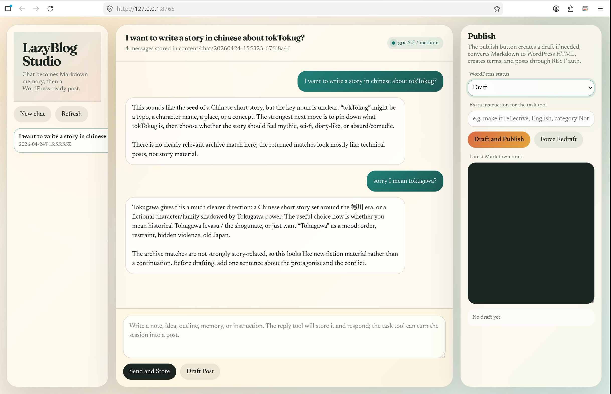

[English](README.md) · [中文 (简体)](i18n/README.zh-Hans.md) · [日本語](i18n/README.ja.md)

[](https://lazying.art)

# LazyBlog

Markdown-first tooling for publishing and maintaining a multilingual WordPress
blog with local AI workflows, media cleanup, and a lightweight translation plugin.

[](https://blog.lazying.art)
[](https://lazying.art)
[](wordpress-plugins/lazyblog-translations)
[](https://github.com/sponsors/lachlanchen)

LazyBlog is built around a simple idea: write in Markdown, keep the source of
truth close to your thinking, then publish to WordPress with images, categories,
language metadata, and reviewed translations.

## Demo Preview



## What Is Inside

| Layer | Path | Purpose |
| --- | --- | --- |
| Markdown publishing | `lazypub`, `scripts/lazypub.py` | Publish a Markdown file from any repo into WordPress |
| Sync engine | `scripts/lazyblog_sync.py` | Maintain post source Markdown, media migration, and translations |
| Translation helper | `scripts/lazyblog_translate.py` | Scaffold and push post translations |
| Category sync | `scripts/sync_live_categories.py` | Pull WordPress category terms and post assignments into local metadata |
| Studio API | `scripts/lazyblog_webapp.py` | Local PWA/API for chat-to-draft and on-demand translation jobs |
| WordPress plugin | `wordpress-plugins/lazyblog-translations/` | Store/render translations and request missing ones asynchronously |
| Local test site | `docker-compose.yml`, `scripts/setup_local_wordpress.sh` | Run a disposable WordPress test site with the plugin mounted |
| Schemas | `schemas/` | JSON contracts for prompt-tool output |

## Quick Start

```bash
git clone --recurse-submodules https://github.com/lazyingart/LazyBlog.git
cd LazyBlog
cp .env.example .env
$EDITOR .env
python3 -m py_compile scripts/*.py
```

If you already cloned without submodules:

```bash
git submodule update --init --recursive
```

Publish a draft from any project:

```bash
./lazypub publish article.md --source-language en --status draft --dry-run
./lazypub publish article.md --source-language en --status draft
```

Publish with reviewed translations:

```bash
./lazypub publish article.md \
  --source-language en \
  --translation ja=translations/article.ja.md \
  --translation zh=translations/article.zh.md \
  --status draft
```

Generate first-pass translations with Codex:

```bash
./lazypub publish article.md \
  --source-language en \
  --auto-translate ja zh \
  --upload-media \
  --remove-dead-images \
  --status draft
```

Mirror live category names/slugs before refreshing the Docker test site:

```bash
python3 scripts/sync_live_categories.py --dry-run
python3 scripts/sync_live_categories.py
./scripts/publish_local_wordpress.sh
```

## WordPress Plugin

LazyBlog Translations is included in:

```text
wordpress-plugins/lazyblog-translations/
```

That path is a Git submodule pointing to
https://github.com/lazyingart/lazyblog-translations, so clicking it on GitHub
opens the standalone plugin repository.

It stores translations as post meta, renders a small language switcher, and can
request a missing translation from one of three providers:

- Codex through the local LazyBlog API
- OpenAI direct API
- DeepSeek direct API

Run a local WordPress test site:

```bash
docker compose up -d
scripts/setup_local_wordpress.sh
```

Prepare the local Codex translation API:

```bash
scripts/install_lazyblog_translation_api.sh --model gpt-5.4 --reasoning low
```

OpenAI and DeepSeek provider modes do not need the local API service.

## Multilingual Documentation

Translations live in `i18n/`:

- [中文 (简体)](i18n/README.zh-Hans.md)
- [日本語](i18n/README.ja.md)

The code and plugin support broader language metadata, including English,
Simplified Chinese, Traditional Chinese, Japanese, Korean, Vietnamese, Arabic,
French, Spanish, German, and Russian.

## Project Links

- Live blog: https://blog.lazying.art
- LazyingArt: https://lazying.art
- Storefront: https://buy.lazying.art
- Public plugin source: https://github.com/lazyingart/lazyblog-translations
- Public workflow source: https://github.com/lazyingart/LazyBlog

## Support

| Donate | PayPal | Stripe |
| --- | --- | --- |
| [](https://chat.lazying.art/donate) | [](https://paypal.me/RongzhouChen) | [](https://buy.stripe.com/aFadR8gIaflgfQV6T4fw400) |

Build less. Publish better. Leave a durable trail.
